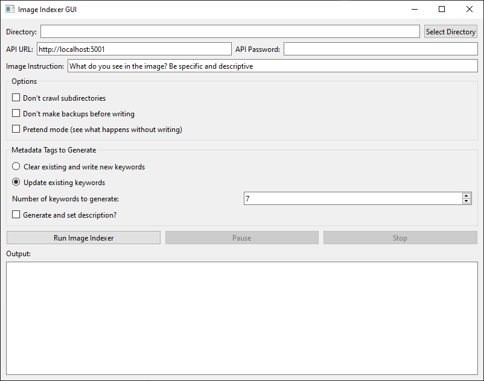

# LLMImageIndexer

[](https://opensource.org/licenses/MIT)

LLMImageIndexer is an intelligent image processing and indexing tool that leverages local AI to generate comprehensive metadata for your image collection. No data is sent to or from your computer to do this except for during the initial process of downloading dependencies and model weights.



## Features

- Automatically crawls directories for image files
- Generates AI-powered captions, titles, tags, and summaries for each image
- Edits image metadata with the generated information
- Stores processed data in a local TinyDB database for easy querying
- Compatible with xnimage-mp for advanced browsing and searching capabilities

## Table of Contents

- [Installation](#installation)
- [Usage](#usage)
- [Configuration](#configuration)
- [Contributing](#contributing)
- [License](#license)

## Installation

### Windows

1. Clone the repository or download the [ZIP file](https://github.com/jabberjabberjabber/LLavaImageTagger/archive/refs/heads/main.zip) and extract it.

2. Install [Python for Windows](https://www.python.org/downloads/windows/).

3. Install ExifTool:
   - Option 1: Use the [installer](https://oliverbetz.de/cms/files/Artikel/ExifTool-for-Windows/ExifTool_install_12.89_64.exe)
   - Option 2: Download the [executable](https://exiftool.org/install.html#Windows) extract it and and place it in the LlavaImageTagger folder

4. Download [KoboldCPP.exe](https://github.com/LostRuins/koboldcpp/releases) and place it in the LlavaImageTagger folder.

5. Run `llmii-run.bat` and wait for the model weights to download and Koboldcpp to start. 

The script will set up the Python environment, install dependencies, and download necessary model weights (6GB total). This initial setup is performed only once and will take a few minutes depending on your download speed.

## Usage

1. Ensure KoboldCPP is running. Do not use the GUI windows until you see:
   ```
   Please connect to custom endpoint at http://localhost:5001
   ```

2. Configure the settings as needed (see [Configuration](#configuration) section). If this is your first time using it, check 'Dry Run'.

3. Run the indexer to process your images.

## Configuration

- **Directory**: Target image directory (includes subdirectories by default)
- **API URL**: KoboldCPP API endpoint (change if running on another machine)
- **Password**: Set if required by your setup
- **No Crawl**: Disable subdirectory scanning
- **Force Rehash**: Reindex all files, including previously processed ones
- **Overwrite**: Skip creating backup files (default: creates 'image_name.jpg_original')
- **Dry Run**: Simulate processing without writing to files
- **Keywords**: Select metadata fields to write to images
- **Output**: View script progress and logs

## FAQ
###What is it doing, exactly?
This is the process the script goes through:
- Looks in the directory for image files
   - If a new image is found it is sent to the AI asking for a detailed description
   - The existing metadata is extracted and sent to the AI added with the description and we ask it to come up with a Title, a Summary, a Subject, and Keywords in a machine readable format
   - The entry is added to the database with that information attached
   - Desired metadata fields are written to the image file itself

###Why are you querying it twice?
The first time we ask it to describe what it sees. This usually results in caption that is not suitable for a use as metadata. By sending it back with more file information and asking for a formal data object we get the data in the form we want.

###Why do the windows show different things?
You are seeing the internal workings of a program in real time interacting with a language model. It is fascinating to look at but you can't take what you see as what we are actually putting in the files or the database. You can run exiftool on the processed images, or check them in xnviewmp and see what metadata is written. The summary in the GUI window what is added to the database, but what is added to the image is whatever boxes you checked.

###How do I use a different model and projector?
Download the GGUF weights and the mmproj weights. Open Koboldcpp.exe and configure it to use those weights and start it then run 'llmii-no-kobold.bat'.

###These models refuse to describe things in my images, how do I make them?
Try abiliterated or uncensored weights of text only models of the same architecture and size with llava projectors. For instance a vicuna 7b projector can be used with most vicuna based models that are also 7b and llama 3 8b projectors can be used with most Llama 3 or 3.1 8b models.  

## Contributing

Contributions are welcome! Please feel free to submit a Pull Request.

## License

This project is licensed under the MIT License - see the [LICENSE](LICENSE) file for details.
