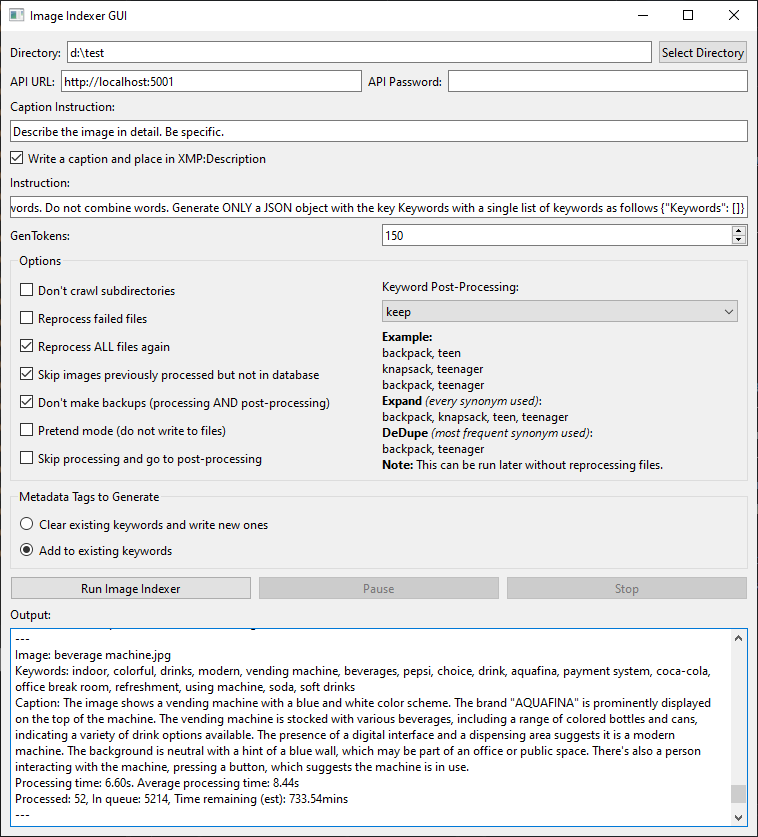

# LLMImageIndexer

[](https://opensource.org/licenses/MIT)

LLMImageIndexer is an intelligent image processing and indexing tool that leverages local AI to generate comprehensive metadata for your image collection. This tool uses advanced language models to analyze images and generate captions and keyword metadata.



## Features
 
- **Intelligent Image Analysis**: Utilizes a local AI model to generate a variable number of keywords and a caption for each image.
- **Metadata Enhancement**: Can automatically edit image metadata with generated tags.
- **Local Processing**: All processing is done locally on your machine.
- **Multi-Format Support**: Handles a wide range of image formats, including all major raw camera files.
- **User-Friendly GUI**: Includes a GUI and installer. Relies on Koboldcpp, a single executable, for all AI functionality.  
- **GPU Acceleration**: Will use Apple Metal, Nvidia CUDA, or AMD (Vulkan) hardware if available to greatly speed inference.
- **Cross-Platform**: Supports Windows, macOS ARM, and Linux.
- **Stop and Start Capability**: Can stop and start without having to reprocess all the files again.
- **Keyword Post-Processing**: Expand keywords so all synonyms are added to every image with one of the synonyms, or deduplicate keywords by using the most frequently used synonym in place of all matching synonyms.  

## Important Information

Before proceeding to use this script you should be aware of the following:

 - This is a project made by someone completely unfamiliar with the formal protocols used by professional photographers. If you rely on your photography to pay bills, you should extensively test the effects of this script before running it on anything important
 - If directed to write the metadata, it will write to following tags using exiftool: MWG:Keywords, XMP:Description, Status, XMP:Identifier. These are not necessarily the names of the tags that exiftool decides will be used. The exiftool developer is probably the foremost expert on file metadata schema and knows the appropriate place to put the metadata better than I could ever hope to. I did spent a lot of time on making this as 'low impact' as possible while still maintaining the ability to keep track of the state of processed images without a central database or repository of information so that the files can be moved anywhere or renamed without issue, but you need to ensure that your images will not be negatively impacted with the data in those fields
 - This is a fairly technical process. Hopefully everything just works, and I tried to make that the case, but I have limited (re:none) ability to test this on other machines or platforms so any number of bugs can crop up. I will try hard to work with people to resolve issues but you should have the technical skills to troubleshoot and follow directions. If you cannot do that, you should proceed with hesitation.
     
## Installation

**Qwen2-VL works with the latest version of KoboldCPP and while KoboldCPP works fine with MiniCPM-V 2.6 (the default, downloaded model) it is not advised to use Qwen2-VL at this point. Due to it not using patches and sending the entire image into the LLM processor it ends up taking an extremely long time for some large images. I am working on a fix but due to holidays it may have to wait until after the new year.**

### Prerequisites

- Python 3.8 or higher
- KoboldCPP

**A vision model is needed, but if you use the llmii-run.bat to open it, then the first time it is run it will download the MiniCPM-V 2.6 Q4_K_M gguf and F16 projector from Bartowski's repo on huggingface. If you don't want to use that, just open llmii-no-kobold.bat instead and open Koboldcpp.exe and load whatever model you like.**
  
### Windows Installation

1. Clone the repository or download the [ZIP file](https://github.com/jabberjabberjabber/LLavaImageTagger/archive/refs/heads/main.zip) and extract it.

2. Install [Python for Windows](https://www.python.org/downloads/windows/).

3. Download [KoboldCPP.exe](https://github.com/LostRuins/koboldcpp/releases) and place it in the LlavaImageTagger folder. If it is not named KoboldCPP.exe, rename it to KoboldCPP.exe 

4. Run `llmii-run.bat` and wait exiftool to install. When it is complete you must start the file again. If you called it from a terminal window you will need to close the windows and reopen it. It will then create a python environment and download the model weights. The download is quite large (6GB) and there is no progress bar, but it only needs to do this once. Once it is done KoboldCPP will start and one of the terminal windows will say ```Please connect to custom endpoint at http://localhost:5001``` and then it is ready.

### macOS Installation (including ARM)

1. Clone the repository or download the [ZIP file](https://github.com/jabberjabberjabber/LLavaImageTagger/archive/refs/heads/main.zip) and extract it.

2. Install Python 3.7 or higher if not already installed. You can use Homebrew:
   ```
   brew install python
   ```

3. Install ExifTool:
   ```
   brew install exiftool
   ```

4. Download [KoboldCPP for macOS](https://github.com/LostRuins/koboldcpp/releases) and place it in the LLMImageIndexer folder.

5. Open a terminal in the LLMImageIndexer folder and run:
   ```
   xattr -cr koboldcpp-mac-arm64
   chmod +x koboldcpp-mac-arm64
   ./llmii-run.sh
   ```

### Linux Installation

1. Clone the repository or download and extract the ZIP file.

2. Install Python 3.7 or higher if not already installed. Use your distribution's package manager, for example on Ubuntu:
   ```
   sudo apt-get update
   sudo apt-get install python3 python3-pip
   ```

3. Install ExifTool. On Ubuntu:
   ```
   sudo apt-get install libimage-exiftool-perl
   ```

4. Download the appropriate KoboldCPP binary for your Linux distribution from [KoboldCPP releases](https://github.com/LostRuins/koboldcpp/releases) and place it in the LLMImageIndexer folder.

5. Open a terminal in the LLMImageIndexer folder and run:
   ```
   chmod +x koboldcpp-linux-x64
   ./llmii-run.sh
   ```

For all platforms, the script will set up the Python environment, install dependencies, and download necessary model weights (6GB total). This initial setup is performed only once and will take a few minutes depending on your download speed.

## Usage

1. Launch the LLMImageIndexer GUI:
   - On Windows: Run `llmii-run.bat`
   - On macOS/Linux: Run `python3 llmii-gui.py`

2. Ensure KoboldCPP is running. Wait until you see the following message in the KoboldCPP window:
   ```
   Please connect to custom endpoint at http://localhost:5001
   ```

3. Configure the indexing settings in the GUI:
   - Select the target image directory
   - Set the API URL (default: http://localhost:5001)
   - Choose metadata tags to generate (keywords, descriptions)
   - Set additional options (crawl subdirectories, backup files, etc.)

4. Click "Run Image Indexer" to start the process.

5. Monitor the progress in the output area of the GUI.

## Configuration Options

- **Directory**: Target image directory (includes subdirectories by default)
- **API URL**: KoboldCPP API endpoint (change if running on another machine)
- **API Password**: Set if required by your KoboldCPP setup
- **Caption**: Have the LLM describe the image and set it in XMP:Description (doubles processing time)
- **GenTokens**: Amount of tokens for the LLM to generate
- **Skip processed files not in database**: Will not attempt to reprocess files with a UUID and keywords even if they are not in the llmii.json database
- **Reprocess failed**: If any files failed in the last round, it will try to process them again
- **Reprocess ALL**: The files that are processed already are stored in a database and skipped if you resume later, this will do them all over again
- **Don't crawl subdirectories**: Disable scanning of subdirectories
- **Don't make backups before writing**: Skip creating backup files (NOTE: this applies to processing and post-processing; if you enable post processing and leave this unchecked it will make a second backup!)
- **Pretend mode**: Simulate processing without writing to files or database
- **Skip processing**: If you want to use the keyword processing and don't want it to check every image in the directory before starting, check this box
- **Keywords**: Choose to clear and write new keywords or update existing ones
- **Post processing keywords**: Keep keywords as generated, Expand keywords by applying all synonyms to matching keywords, or Dedepe keywords by replacing matching synonyms with most frequent synonym; these option take place after the indexer has completed unless the 'skip processing' box is checked

## More Information and Troubleshooting

Consult [the wiki](https://github.com/jabberjabberjabber/LLavaImageTagger/wiki) for more information and troubleshooting steps.


## Contributing

Contributions are welcome! Please feel free to submit a Pull Request.

## License

This project is licensed under the MIT License - see the [LICENSE](LICENSE) file for details.

## Acknowledgements

- [ExifTool](https://exiftool.org/) for metadata manipulation
- [KoboldCPP](https://github.com/LostRuins/koboldcpp) for local AI processing
- [PyQt6](https://www.riverbankcomputing.com/software/pyqt/) for the GUI framework
- [Fix Busted JSON](https://github.com/Qarj/fix-busted-json) and [Json Repair](https://github.com/josdejong/jsonrepair) for help with mangled JSON parsing
