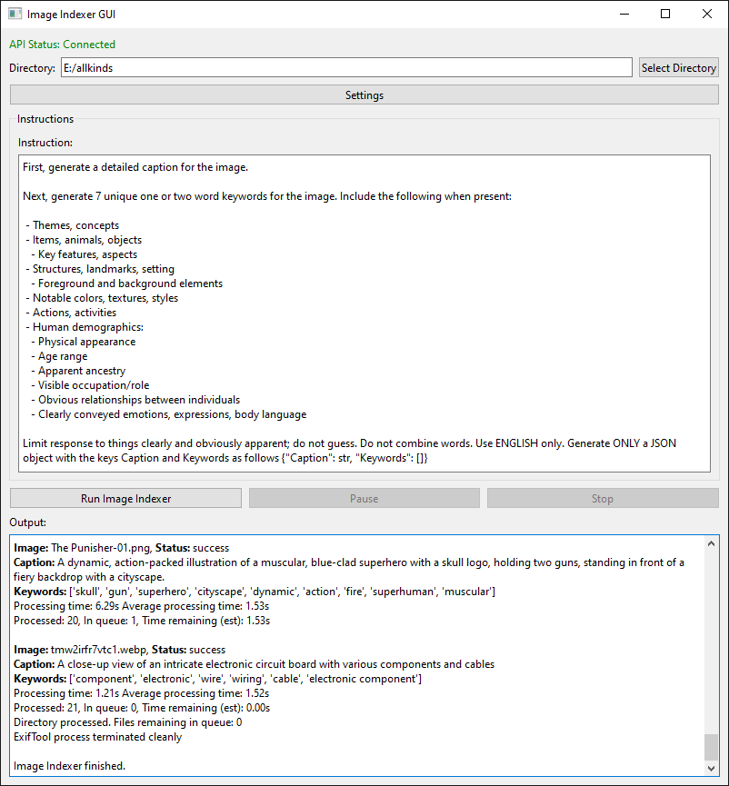

# LLMImageIndexer

[](https://opensource.org/licenses/MIT)

LLMImageIndexer creates keywords and captions for images and puts them into the file's metadata using a local AI. No data leaves your computer during this process -- once the install and download of the model weights and KoboldCpp executable is completed the internet is not needed or used. 

By storing the information in the file metadata the images can be moved, renamed, or copied without issue. The indexer can also be run multiple times on the same files and will not reprocess them unless directed to.

Uses the Qwen2-VL 2B model, a 2 billion parameter multimodal local large language model. It runs on your machine to recognize images and describe them and generate keywords. However, you can use any image model you like as long as it has weights in the "gguf" filetype and it has an appropriate "mmproj" image projector. 

**As of March 2025**:
   - The tool no longer uses a database. Files can be moved and renamed, and if the tool is run on them again, they will be automatically recognized as already processed!
   - Refactored for major speed improvement. Time for image processing reduced by 3 - 4 seconds! Average speed with "Quick fail" and "Short caption" is 1.5 seconds per image on Windows with an nVidia 3080 using Qwen2-VL-2B at Q6_K. 



## Features
 
- **Image Analysis**: Utilizes a local AI model to generate a list of keywords and a caption for each image
- **Metadata Enhancement**: Can automatically edit image metadata with generated tags
- **Local Processing**: All processing is done locally on your machine
- **Multi-Format Support**: Handles a wide range of image formats, including all major raw camera files
- **User-Friendly GUI**: Includes a GUI and installer. Relies on Koboldcpp, a single executable, for all AI functionality
- **GPU Acceleration**: Will use Apple Metal, Nvidia CUDA, or AMD (Vulkan) hardware if available to greatly speed inference
- **Cross-Platform**: Supports Windows, macOS ARM, and Linux
- **Stop and Start Capability**: Can stop and start without having to reprocess all the files again
- **One or Two Step Processing**: Can do keywords and a simple caption in one step, or keywords and a detailed caption in two steps

## Important Information

It is recommended to have a discrete graphics processor in your machine. Running this on CPU will be extremely slow.

This tool verifies keywords and de-pluralizes them using rules that apply to English. Using it to generate keywords in other languages may have strange results.

This tool operates directly on image file metadata. It will write to one or more of the following fields:

  1. MWG:Keyword
  2. MWG:Description
  3. XMP:Identifier
  4. XMP:Status
  
The "Status" and "Identifier" fields are used to track the processing state of images. The "Description" field is used for the image caption, and "Subject" or "Keyword" fields are used to hold keywords.

**The use of the Identifier tag means you can manage your files and add new files, and run the tool as many times as you like without worrying about reprocessing the files that were previously keyworded by the tool.**
     
## Installation

### Prerequisites

- Python 3.8 or higher
- KoboldCPP

**A vision model is needed, but if you use the llmii-run.bat to open it, then the first time it is run it will download the Qwen2-VL 2B Q4_K_M gguf and F16 projector from Bartowski's repo on huggingface. If you don't want to use that, just open llmii-no-kobold.bat instead and open Koboldcpp.exe and load whatever model you like.**
  
### Windows Installation

1. Clone the repository or download the [ZIP file](https://github.com/jabberjabberjabber/LLavaImageTagger/archive/refs/heads/main.zip) and extract it

2. Install [Python for Windows](https://www.python.org/downloads/windows/)

3. Run `llmii-run.bat` and wait exiftool to install and KoboldCpp to download. When it is complete you must start the file again. If you called it from a terminal window you will need to close the windows and reopen it. It will then create a python environment and download the model weights

### macOS Installation (including ARM)

1. Clone the repository or download the [ZIP file](https://github.com/jabberjabberjabber/LLavaImageTagger/archive/refs/heads/main.zip) and extract it

2. Install Python 3.7 or higher if not already installed. You can use Homebrew:
   ```
   brew install python
   ```

3. Install ExifTool:
   ```
   brew install exiftool
   ```

4. Run the script:
   ```
   ./llmii-run.sh
   ```
   
5. If KoboldCpp fails to run, open a terminal in the LLMImageIndexer folder:
   ```
   xattr -cr koboldcpp-mac-arm64
   chmod +x koboldcpp-mac-arm64
   ```

### Linux Installation

1. Clone the repository or download and extract the ZIP file

2. Install Python 3.8 or higher if not already installed. Use your distribution's package manager, for example on Ubuntu:
   ```
   sudo apt-get update
   sudo apt-get install python3 python3-pip
   ```

3. Install ExifTool. On Ubuntu:
   ```
   sudo apt-get install libimage-exiftool-perl
   ```

4. Run the script:
   ```
   ./llmii-run.sh
   ```

5. If KoboldCpp fails to run, open a terminal in the LLMImageIndexer folder:
   ```
   chmod +x koboldcpp-linux-x64
   ```

For all platforms, the script will set up the Python environment, install dependencies, and download necessary model weights. This initial setup is performed only once and will take a few minutes depending on your download speed.

## Usage

1. Launch the LLMImageIndexer GUI:
   - On Windows: Run `llmii-run.bat`
   - On macOS/Linux: Run `./llmii-run.sh`

2. Ensure KoboldCPP is running. Wait until you see the following message in the KoboldCPP window:
   ```
   Please connect to custom endpoint at http://localhost:5001
   ```

3. Configure the indexing settings in the GUI

4. Click "Run Image Indexer" to start the process

5. Monitor the progress in the output area of the GUI.

## Settings

   - **API URL**: The address for the KoboldCpp API server
   - **Password**: Only needed if you set a password via KoboldCpp, used to access the API
   - **System Instruction**: This will be whatever the model is trained to use. Best not to mess with it unless you know what you are doing
   - **Caption Instruction**: Tells the model how to create a detailed caption. Set to whatever you like, but the default works fine
   - **Generate detailed caption**: Will use a generation to create a caption, and another generation to create keywords. You end up with a much more detailed caption at the expense of twice the compute time. Usually not worth it
   - **Generate short caption**: the default. Caption is generated along with keywords
   - **No caption**: Use this only if you don't want to overwrite an existing caption. It does not save any compute time
   - **Don't crawl subdirectories**: Will only look for images in the directory you specify, and will not go into any others inside it
   - **Reprocess all files again**: Regardless of previous processing status, reprocess all images. This is useful if you want to add more keywords with a second processing step by using it along with the "Add to existing keywords" option. Best results in a different model is used for each processing
   - Reprocess failed files: does what it says
   - **If file has UUID, mark status**: This will look for a UUID in the file which was set by the tool. If it finds one, it will see if there are keywords in the metadata and if so mark the file status as 'success'. This allows you to run it on files previously process by and older version that used a database for marking status without having to reprocess every file again. Once the file has the status set it will be just like any other file processed by the new version of the tool
   - **No file checking**: This will skip the file verification step. Only use this if you are having a problem with valid files being skipped. It may cause the indexer to freeze if files with errors are encountered
   - **Pretend mode / Dry run**: Let's you see what output you would get from the LLM without actually writing to any files
   - **Quick fail**: If any kind of error occurs parsing the data from the LLM, don't bother retrying it and mark the file failed and move on. Use this if you are in a hurry
   - **Add new keywords to existing keywords**: Will append the generated keywords to any existing keywords. If this isn't checked and there are keywords in the field that exiftool writes the new keywords to, they will be overwritten
   - **Add new caption to existing caption with <caption>**: If a caption is generated and a caption already exists in the field exiftool writes the caption to, it will wrap the generated caption with <generated> and </generated> and append it to the end of the existing one  

## More Information and Troubleshooting

Consult [the wiki](https://github.com/jabberjabberjabber/LLavaImageTagger/wiki) for detailed information.

## Contributing

Contributions are welcome! Please feel free to submit a Pull Request.

## License

This project is licensed under the MIT License - see the [LICENSE](LICENSE) file for details.

## Acknowledgements

- [ExifTool](https://exiftool.org/) for metadata manipulation
- [KoboldCPP](https://github.com/LostRuins/koboldcpp) for local AI processing
- [PyQt6](https://www.riverbankcomputing.com/software/pyqt/) for the GUI framework
- [Fix Busted JSON](https://github.com/Qarj/fix-busted-json) and [Json Repair](https://github.com/josdejong/jsonrepair) for help with mangled JSON parsing
