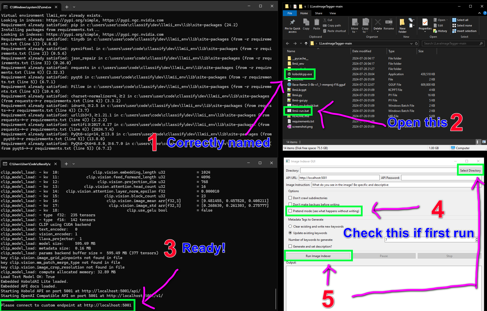

# LLMImageIndexer

[](https://opensource.org/licenses/MIT)

LLMImageIndexer is an intelligent image processing and indexing tool that leverages local AI to generate comprehensive metadata for your image collection. This tool uses advanced language models to analyze images and create rich, descriptive metadata without sending any data over the internet, ensuring your privacy and data security.

[Imgur](https://imgur.com/nYM9VcH)

## Features
 
- **Intelligent Image Analysis**: Utilizes a local AI model to generate a variable number of keywords and a description for each image.
- **Metadata Enhancement**: Can automatically edit image metadata with generated tags.
- **Local Processing**: All processing is done locally on your machine.
- **Multi-Format Support**: Handles a wide range of image formats, including all major raw camera files: arw cr2 dng gif jpeg tif tiff jpg nef orf pef png raf rw2 srw
- **Flexible Configuration**: Options include number of keywords, update or write clean, custom prompt, description generation and directory traversal.
- **User-Friendly GUI**: Includes a GUI and installer. Relies on Koboldcpp, a single executable, for all AI functionality.  
- **GPU Acceleration**: Will use Apple Metal, Nvidia CUDA, or AMD (Vulkan) hardware if available to greatly speed inference.
- **Cross-Platform**: Supports Windows, macOS ARM, and Linux.
- **Stop and start capability**: You can stop and start again later without having to reprocess all the files again
- **Writes to a local plain-text database file**: The filedata.json file in the script directory contains information about files processed and is readable with any text editor
- **Lemmatizes keywords**: combines various forms of the same words together using natural language processing
- **Now much faster**: latest update has reduced average processing time for an image from 12 seconds to 2.5 seconds when used with an RTX3080 GPU

## Installation

### Prerequisites

- Python 3.7 or higher
- KoboldCPP

### Windows Installation

1. Clone the repository or download the [ZIP file](https://github.com/jabberjabberjabber/LLavaImageTagger/archive/refs/heads/main.zip) and extract it.

2. Install [Python for Windows](https://www.python.org/downloads/windows/).

3. Download [KoboldCPP.exe](https://github.com/LostRuins/koboldcpp/releases) and place it in the LLMImageIndexer folder. If it is not named KoboldCPP.exe, rename it to KoboldCPP.exe 

4. Run `llmii-run.bat` and wait exiftool to install. When it is complete you must start the file again. If you called it from a terminal window you will need to close the windows and reopen it. It will then create a python environment and download the model weights and KoboldCPP to start. The download is quite large (6GB) and there is no progress bar, but it only needs to do this once. Once it is done KoboldCPP will start and one of the terminal windows will say ```Please connect to custom endpoint at http://localhost:5001``` and then it is ready.

### macOS Installation (including ARM)

1. Clone the repository or download the [ZIP file](https://github.com/jabberjabberjabber/LLavaImageTagger/archive/refs/heads/main.zip) and extract it.

2. Install Python 3.7 or higher if not already installed. You can use Homebrew:
   ```
   brew install python
   ```

3. Install ExifTool:
   ```
   brew install exiftool
   ```

4. Download [KoboldCPP.exe](https://github.com/LostRuins/koboldcpp/releases) and place it in the LLMImageIndexer folder.

5. Open a terminal in the LLMImageIndexer folder and run:
   ```
   chmod +x koboldcpp-mac-arm64
   ./llmii-run.sh
   ```

### Linux Installation

1. Clone the repository or download and extract the ZIP file.

2. Install Python 3.7 or higher if not already installed. Use your distribution's package manager, for example on Ubuntu:
   ```
   sudo apt-get update
   sudo apt-get install python3 python3-pip
   ```

3. Install ExifTool. On Ubuntu:
   ```
   sudo apt-get install libimage-exiftool-perl
   ```

4. Download the appropriate KoboldCPP binary for your Linux distribution from [KoboldCPP releases](https://github.com/LostRuins/koboldcpp/releases) and place it in the LLMImageIndexer folder.

5. Open a terminal in the LLMImageIndexer folder and run:
   ```
   chmod +x koboldcpp-linux-x64
   ./llmii-run.sh
   ```

For all platforms, the script will set up the Python environment, install dependencies, and download necessary model weights (6GB total). This initial setup is performed only once and will take a few minutes depending on your download speed.

## Usage

1. Ensure KoboldCPP is running. Wait until you see the following message in the KoboldCPP window:
   ```
   Please connect to custom endpoint at http://localhost:5001
   ```

2. Launch the LLMImageIndexer GUI:
   - On Windows: Run `llmii-run.bat`
   - On macOS/Linux: Run `python3 llmii-gui.py`

3. Configure the indexing settings in the GUI:
   - Select the target image directory
   - Set the API URL (default: http://localhost:5001)
   - Choose metadata tags to generate (keywords, descriptions)
   - Set additional options (crawl subdirectories, backup files, etc.)

4. Click "Run Image Indexer" to start the process.

5. Monitor the progress in the output area of the GUI.

## Configuration Options

- **Directory**: Target image directory (includes subdirectories by default)
- **API URL**: KoboldCPP API endpoint (change if running on another machine)
- **API Password**: Set if required by your KoboldCPP setup
- **Reprocess**: The files that are processed already are stored in a database and skipped if you resume later, this will do them all over again
- **Don't crawl subdirectories**: Disable scanning of subdirectories
- **Lemmatize keywords**: Combine various forms of the same word together (example: run, ran, running will be combined to 'run')
- **Don't make backups before writing**: Skip creating backup files
- **Pretend mode**: Simulate processing without writing to files
- **Keywords**: Choose to clear and write new keywords or update existing ones
- **Number of keywords**: Set the number of keywords to generate


## Troubleshooting

- If you encounter issues with ExifTool, ensure it's properly installed and accessible in your system PATH.
- Make sure KoboldCPP is running and the API URL in the GUI matches the KoboldCPP endpoint.
- Check the output area in the GUI for error messages and warnings.
- On macOS or Linux, if you get a "permission denied" error when running KoboldCPP, make sure you've made the binary executable with `chmod +x`.

## Contributing

Contributions are welcome! Please feel free to submit a Pull Request.

## License

This project is licensed under the MIT License - see the [LICENSE](LICENSE) file for details.

## Acknowledgements

- [ExifTool](https://exiftool.org/) for metadata manipulation
- [KoboldCPP](https://github.com/LostRuins/koboldcpp) for local AI processing
- [PyQt6](https://www.riverbankcomputing.com/software/pyqt/) for the GUI framework

## Disclaimer

This tool is designed for personal use and should be used responsibly. Always ensure you have the right to modify and tag the images you process.
