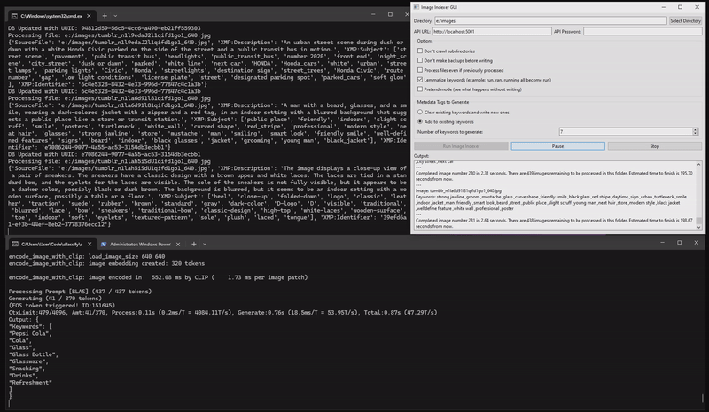

# LLMImageIndexer

[](https://opensource.org/licenses/MIT)

LLMImageIndexer is an intelligent image processing and indexing tool that leverages local AI to generate comprehensive metadata for your image collection. This tool uses advanced language models to analyze images and generate keyword metadata without sending any data over the internet, ensuring your privacy and data security.



## Features
 
- **Intelligent Image Analysis**: Utilizes a local AI model to generate a variable number of keywords for each image.
- **Metadata Enhancement**: Can automatically edit image metadata with generated tags.
- **Local Processing**: All processing is done locally on your machine.
- **Multi-Format Support**: Handles a wide range of image formats, including all major raw camera files.
- **User-Friendly GUI**: Includes a GUI and installer. Relies on Koboldcpp, a single executable, for all AI functionality.  
- **GPU Acceleration**: Will use Apple Metal, Nvidia CUDA, or AMD (Vulkan) hardware if available to greatly speed inference.
- **Cross-Platform**: Supports Windows, macOS ARM, and Linux.
- **Stop and Start Capability**: Can stop and start without having to reprocess all the files again.

## Installation

### Prerequisites

- Python 3.8 or higher
- KoboldCPP

### Windows Installation

1. Clone the repository or download the [ZIP file](https://github.com/jabberjabberjabber/LLavaImageTagger/archive/refs/heads/main.zip) and extract it.

2. Install [Python for Windows](https://www.python.org/downloads/windows/).

3. Download [KoboldCPP.exe](https://github.com/LostRuins/koboldcpp/releases) and place it in the LlavaImageTagger folder. If it is not named KoboldCPP.exe, rename it to KoboldCPP.exe 

4. Run `llmii-run.bat` and wait exiftool to install. When it is complete you must start the file again. If you called it from a terminal window you will need to close the windows and reopen it. It will then create a python environment and download the model weights. The download is quite large (6GB) and there is no progress bar, but it only needs to do this once. Once it is done KoboldCPP will start and one of the terminal windows will say ```Please connect to custom endpoint at http://localhost:5001``` and then it is ready.

### macOS Installation (including ARM)

1. Clone the repository or download the [ZIP file](https://github.com/jabberjabberjabber/LLavaImageTagger/archive/refs/heads/main.zip) and extract it.

2. Install Python 3.7 or higher if not already installed. You can use Homebrew:
   ```
   brew install python
   ```

3. Install ExifTool:
   ```
   brew install exiftool
   ```

4. Download [KoboldCPP for macOS](https://github.com/LostRuins/koboldcpp/releases) and place it in the LLMImageIndexer folder.

5. Open a terminal in the LLMImageIndexer folder and run:
   ```
   chmod +x koboldcpp-mac-arm64
   ./llmii-run.sh
   ```

### Linux Installation

1. Clone the repository or download and extract the ZIP file.

2. Install Python 3.7 or higher if not already installed. Use your distribution's package manager, for example on Ubuntu:
   ```
   sudo apt-get update
   sudo apt-get install python3 python3-pip
   ```

3. Install ExifTool. On Ubuntu:
   ```
   sudo apt-get install libimage-exiftool-perl
   ```

4. Download the appropriate KoboldCPP binary for your Linux distribution from [KoboldCPP releases](https://github.com/LostRuins/koboldcpp/releases) and place it in the LLMImageIndexer folder.

5. Open a terminal in the LLMImageIndexer folder and run:
   ```
   chmod +x koboldcpp-linux-x64
   ./llmii-run.sh
   ```

For all platforms, the script will set up the Python environment, install dependencies, and download necessary model weights (6GB total). This initial setup is performed only once and will take a few minutes depending on your download speed.

## Usage

1. Ensure KoboldCPP is running. Wait until you see the following message in the KoboldCPP window:
   ```
   Please connect to custom endpoint at http://localhost:5001
   ```

2. Launch the LLMImageIndexer GUI:
   - On Windows: Run `llmii-run.bat`
   - On macOS/Linux: Run `python3 llmii-gui.py`

3. Configure the indexing settings in the GUI:
   - Select the target image directory
   - Set the API URL (default: http://localhost:5001)
   - Choose metadata tags to generate (keywords, descriptions)
   - Set additional options (crawl subdirectories, backup files, etc.)

4. Click "Run Image Indexer" to start the process.

5. Monitor the progress in the output area of the GUI.

## Configuration Options

- **Directory**: Target image directory (includes subdirectories by default)
- **API URL**: KoboldCPP API endpoint (change if running on another machine)
- **API Password**: Set if required by your KoboldCPP setup
- **Reprocess failed**: If any files failed in the last round, it will try to process them again
- **Reprocess ALL**: The files that are processed already are stored in a database and skipped if you resume later, this will do them all over again
- **Don't crawl subdirectories**: Disable scanning of subdirectories
- **Don't make backups before writing**: Skip creating backup files
- **Pretend mode**: Simulate processing without writing to files or database
- **Keywords**: Choose to clear and write new keywords or update existing ones


## How It Works

LLMImageIndexer processes images using a combination of local file system operations, database management, and AI-powered analysis. Here's a detailed breakdown of the process:

1. **Image Discovery**: 
   - The tool recursively scans the specified directory (unless the "no crawl" option is set) for supported image file formats.
   - Supported formats include JPEG, PNG, GIF, TIFF, BMP, WEBP, HEIF, and various RAW formats (ARW, CR2, DNG, NEF, ORF, PEF, RAF, RW2, SRW, etc.).
   - If supported files are found in a directory, they will be added to the queue and the number of files added are displayed in the GUI.
   
2. **Metadata Extraction**:
   - ExifTool is used to extract existing metadata from each image file.
   - Extracted fields include XMP:Description, Subject, Keywords, XMP:Identifier, and FileType.

3. **Database Management**:
   - A TinyDB database (filedata.json) is created in the target directory to track processed files.
   - Each file will be checked for XMP:Identifier to see if it that UUID exists in the database.
   - If no identifier is found a UUID is generated for it.
   - If the file was previously processed it is removed from the queue.

4. **Image Preprocessing**:
   - All image preprocessing happens in memory only; images themselves are not modified except to change metadata.
   - For RAW images: The tool attempts to extract the embedded JPEG thumbnail. If unsuccessful, it converts it to a PNG.
   - For native JPEG, PNG, and BMP files: The images are not preprocessed.
   - For other formats: The images are converted to PNG using RGB.
   - All preprocessed images are converted to base64-encoded strings to be sent to the LLM.

5. **LLM Querying**:
   - The tool communicates with KoboldCPP via its API (default: http://localhost:5001).
   - It determines the instruction prompt template to use by asking for the running model and parsing out the name.
   - It sends a POST request to the /api/v1/generate endpoint with the base64-encoded image as a single item in a list along with an instruction prompt.
   - The instruction prompt is customizable and directs the LLM to generate keywords for various aspects of the image.

6. **AI Response Processing**:
   - The LLM is expected to return a JSON object with a "Keywords" key containing an array of keyword strings.
   - If the response isn't in the expected format, the tool attempts to repair the JSON.
   - If JSON repair fails, the tool marks the file to retry after the other files have finished.

7. **Keyword Processing**:
   - Generated keywords are normalized (converted to lowercase, spaces standardized, non-alphanumeric characters except hyphens removed).
   - Keywords are deduplicated.

8. **Metadata Update**:
   - The tool updates the image metadata with the new keywords using ExifTool.
   - Unless "Do not make backups" is specified, ExifTool will make a copy of the image and store it as filename.extension_original.
   - Depending on user settings, it either replaces existing keywords or adds to them.
	  - If updating it will take the contents of the IPTC:Keywords and XMP:Subject and Keywords fields and add them to the generated keywords.
   - All existing keywords fields in the image file metadata are cleared.
   - Keywords are placed in MWG:Keywords using ExifTool, which determines where to place them (usually XMP:Subject).
   - If the "dry run" option is set, no actual changes are made to the files and the database will not used.

9. **Error Handling and Retries**:
   - If a file fails processing, it is retried once. 
   - When processing fails it is usually because the model does not give back data that can be parsed as keywords, and a second shot will get a valid generation.
   - If a file fails again, it's marked as "failed" in the database, and the failure is reported in the GUI.
   - Failed files can be processed again along with any unprocessed files by checking the appropriate box.

10. **GUI Feedback**:
    - The GUI provides real-time updates on processing status, including:
      - Number of files processed and remaining.
      - Processing time per image and average processing time.
      - Any errors or warnings encountered.

11. **Options processing**:
	- You may add a custom instruction in the appropriate field. Results will be highly variable and using the default prompt is suggested.
	- If "Don't crawl subdirectories" is checked, only images in the base directory specified will be processed.
	- If "Don't make backups before writing" is checked, ExifTool will not make a backup of the original file named filename.ext_original before modifying.
	- If "Reprocess faild files" is checked, any files that have been marked as "retry" or "failed" along with any unprocessed files will be processed.
	- If "Reprocess ALL files again" is checked, all files will reprocessed again, regardless of previous processing. Note: this will not change the file's UUID or "status" or any of its metadata. If you want to actually reset the database you must delete the "filedata.json" file in the root directory you are processing.
	- If "Pretend mode" is checked, files will be processed according to the options specified as normal, but nothing will be actually written to the file's metadata or the database.
	- If the "Clear existing keywords and write new ones" radio button is selected, all keywords that are in the image file's metadata are removed and replaced with the generated ones.
	- If the "Add to existing keywords' radio button is selected, any existing keywords in the image file's metadata are added along with the generated ones.
	- The "Pause" button temporarily stops the processing and waits you to unpause it
	- The "Stop" button completely stops the indexing process. If it is started again it will start from the beginning but will only reprocess files unless the appropriate box is checked.


## Troubleshooting

- [See this guide](https://old.reddit.com/r/LocalLLaMA/comments/1f7cdhj/koboldcpp_and_vision_models_a_guide/) for help choosing models and projectors.
- If you encounter issues with ExifTool, ensure it's properly installed and accessible in your system PATH.
- In order to speed start-time, the queue counter only counts the files in the current directory being crawled. If you have many subdirectories and want to know how many files are left to proccess, find the number of image files in all of the directories and subract them from the files processed. 
- Make sure KoboldCPP is running and the API URL in the GUI matches the KoboldCPP endpoint.
- Check the output area in the GUI for error messages and warnings.
- If the output window says it finished but it didn't do anything, make sure the folder you pointed it to exists.
- Make sure you are always using the latest version of KoboldCPP. It gets updated very frequently (multiple times per month).
- If the downloaded model is not to your liking, is too slow, or to big, you can choose any model you like! Find a gguf and matching projector and run koboldcpp.exe and load them and then run llmii-no-kobold.bat
- If you are using your own model and are getting strange results, make sure that the projector matches (Llama-3.1-8b must have a matching Llama-3.1-8b-mmproj with it, for example)
- If you are using your own model and are still getting strange results, make sure that the name of the gguf matches at least partially the name of the base model it was trained on (llava-v1.6-34b.gguf should be named llava-vicuna-v1.6-34b.gguf for example). This is because the prompt templates are chosen automatically using the model's filename! 
- On macOS or Linux, if you get a "permission denied" error when running KoboldCPP, make sure you've made the binary executable with `chmod +x`.

## Contributing

Contributions are welcome! Please feel free to submit a Pull Request.

## License

This project is licensed under the MIT License - see the [LICENSE](LICENSE) file for details.

## Acknowledgements

- [ExifTool](https://exiftool.org/) for metadata manipulation
- [KoboldCPP](https://github.com/LostRuins/koboldcpp) for local AI processing
- [PyQt6](https://www.riverbankcomputing.com/software/pyqt/) for the GUI framework
- [Fix Busted JSON](https://github.com/Qarj/fix-busted-json) and [Repair-Json]( for help with mangled JSON parsing
